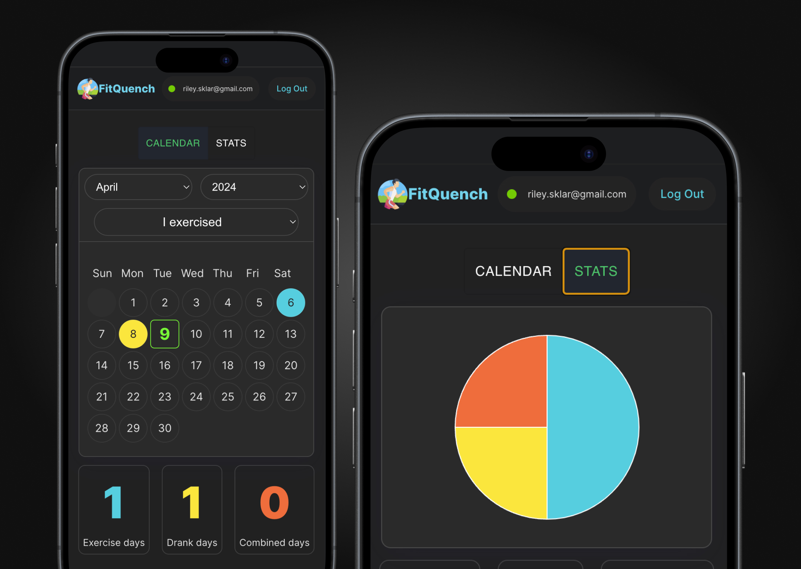

# 🏋️‍♂️ FitQuench 🍺



Welcome to FitQuench, a fun and interactive app built with React & Vite! This app is designed to help you keep track of your exercise and drinking habits.

## 🎯 What does it do?

FitQuench allows you to log the days you exercise 🏃‍♀️ and the days you enjoy a drink 🍷. It provides a visual representation of your habits, helping you understand your lifestyle better.

## 🚀 Setup and Usage

FitQuench is built using Vite, Node.js, and React. Follow these steps to get it up and running on your local machine:

1. **Clone the repository**

```bash
git clone https://github.com/rileysklar/excerTracker.git
cd excertracker
```

2. Install dependencies

```bash
npm install
```

3. Set up environment variables
   Create a .env file in the root directory of the project, and add your environment variables:

```bash
REACT_APP_SUPABASE_URL=your_supabase_url
REACT_APP_SUPABASE_ANON_KEY=your_supabase_anon_key
```

4. Start the development server

```bash
npm run dev
```

Now, FitQuench should be running at http://localhost:5000.
